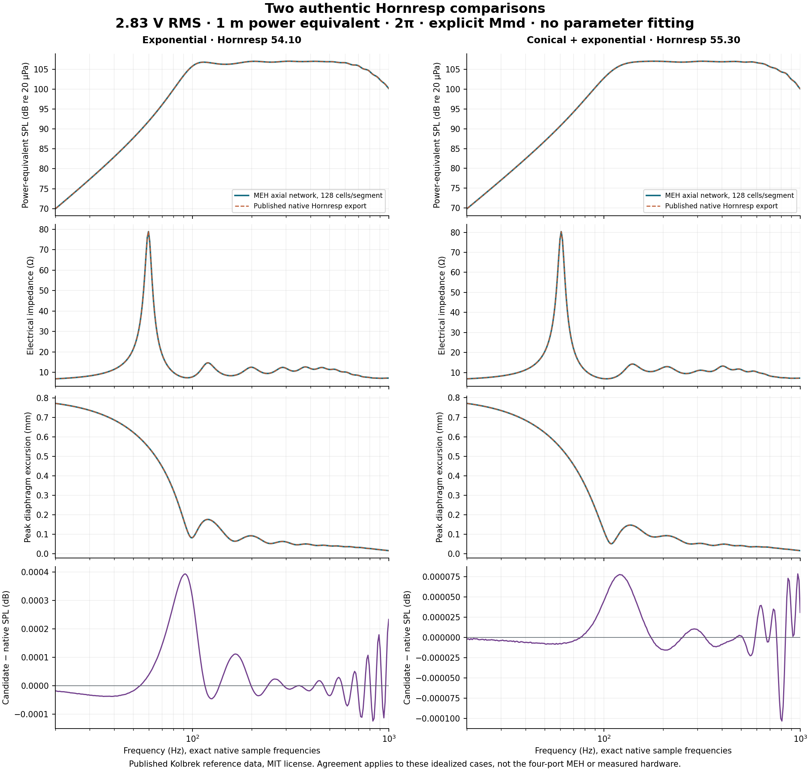
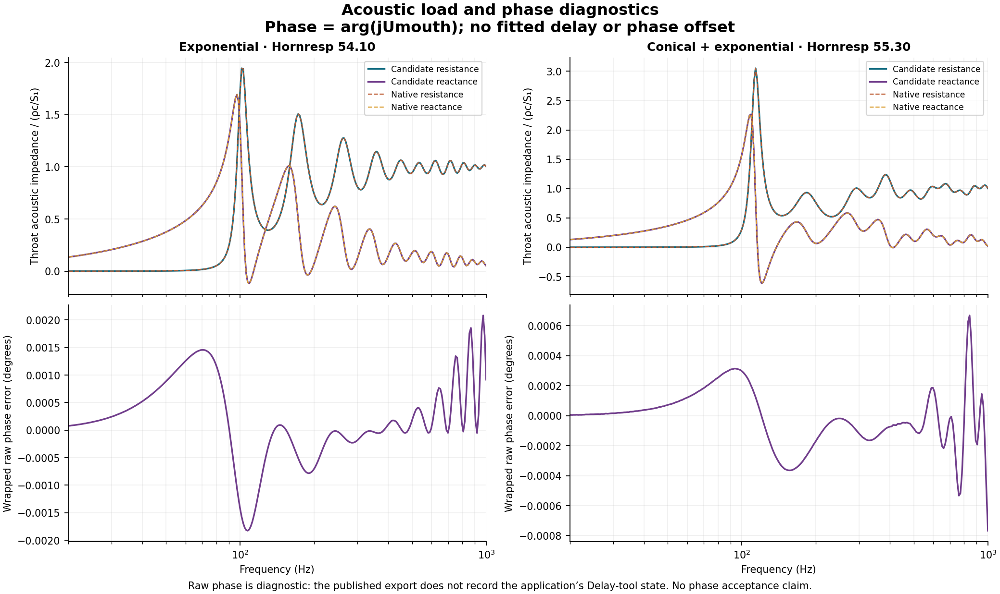

# Hornresp evidence and reproducible comparisons

Two genuine, published Hornresp exports now have reproducible numerical comparisons. This is evidence for the existing axial horn solver plus the **benchmark-only generic driver adapter** in `benchmarks/candidate.cjs`. It does not validate the saved four-port MEH, its insert, a spatial horn field, or measured hardware. New single-conical and two-entry captures remain pending. “Equal or better than Hornresp” is not an established general result.

## What Hornresp actually models

Hornresp’s main response calculation must not be described as a 2D field simulation. David McBean describes a distinction between plane-wave and isophase area-law treatments, including curved subelements for the latter. He states that multiple-segment horns use the plane-wave model. A later explanation says single-segment exponential horns can switch to an isophase model when `Cir > 1`; adding a short initial segment changes that treatment. These are author statements about particular versions, so capture the version when comparing. [McBean, 2014, posts 182 and 191–194](https://www.diyaudio.com/community/threads/danley-bc-subs-reverse-engineered.263812/post-4114865), [McBean, 2017, post 7863](https://www.diyaudio.com/community/threads/hornresp.119854/page-394).

The separate **Wavefront Simulator** displays isophase contours on a 2D horn schematic. McBean explicitly distinguishes its relative-phase display from pressure amplitude. Its separated source display must not be mistaken for the main electroacoustic response solver or a calibrated 3D radiation solution. [McBean, 2009, quoted in post 671](https://www.diyaudio.com/community/threads/hornresp.119854/page-34).

For multiple-entry horns, independent `Nd`, `ME1`, and optionally `ME2` records are linked by activating the side-entry records and opening the Multiple Entry Horn Wizard from `Nd`. The ME1 port’s geometric centre is at `S2`, an axial distance `L12` from the throat. In 2025 McBean explicitly stated that side ports and drivers are assumed axisymmetric. Four discrete azimuthal entries, unequal phases and their transverse interference therefore need additional spatial evidence. [Record linkage](https://www.diyaudio.com/community/threads/hornresp.119854/page-277), [port centre](https://www.diyaudio.com/community/threads/hornresp.119854/page-680), [axisymmetry and axial distances](https://www.diyaudio.com/community/threads/hornresp.119854/page-807).

## Conventions that must match

The archived author help defines `Eg` as open-circuit RMS voltage, `Mmd` as moving mechanical mass excluding air loading, and displacement as one-way maximum. Default SPL represents constant-directivity acoustic power at a normalized 1 m distance, rather than a general on-axis pressure prediction. Acoustic impedance is normalized and requires its scaling factor. Default phase can include a delay correction; the Delay tool permits zero correction. The documented medium is 1.205 kg/m³ and 344 m/s. The help describes chart-data CSV/text export. It is an archived version, not proof of every present option. [Hornresp Help, input/results/export/notes](https://pearl-hifi.com/06_Lit_Archive/14_Books_Tech_Papers/Kolbrek_Bjorn/Horn_Response_Manual.pdf).

McBean says the air-load subtraction uses a rigid circular piston’s acoustic impedance at `fs`, not an arbitrary fixed mass. Our benchmark motors specify `Mmd` directly, avoiding any conversion. The user’s catalog `Mms` requires its own auditable conversion when explicitly resolving front/rear air. [McBean, 2011, post 1824](https://www.diyaudio.com/community/threads/hornresp.119854/page-92).

The implementation uses RMS `exp(+jωt)` phasors, pressure in Pa, acoustic volume velocity in m³/s, and `P = Re(p conj(U))`. Driver velocity is `U/Sd`. Peak excursion is `sqrt(2)|U|/(ω Sd)`, and peak port speed is `sqrt(2)|Uport|/Sport`. Mechanical-to-acoustic impedance conversion divides by `Sd²`. For half-space power output, `SPL = 10 log10(P ρc / (2π r² pref²))`, `pref = 20 µPa`. The same mouth radiation impedance participates in the network loading and its output power. No disconnected exterior gain factor is appended. This power-equivalent curve does not establish observer directivity.

## Authentic reference provenance

The user already had Bjørn Kolbrek’s MIT-licensed `HornSimulation-main` download. We copied the four paired input/output files unchanged into `benchmarks/references/kolbrek/` and retained the license. The author’s own articles identify the code and native comparisons, and link the public repository. The download had no Git revision metadata: its initial SHA-256 byte hashes, acquisition path, authorship and that limitation are pinned in `PROVENANCE.json`. The runner refuses changed reference bytes. There was **no new native Hornresp run** in this task. [Kolbrek’s part 2](https://kolbrek.hornspeakersystems.info/index.php/horns/horn-loudspeaker-simulation-part-2-adding-a-driver), [part 3](https://kolbrek.hornspeakersystems.info/index.php/horns/horn-loudspeaker-simulation-part-3-multiple-segments-more-t-matrices), [author repository](https://github.com/bkolbrek/HornSimulation).

| Case | Native input / export | Horn | Native version |
|---|---|---|---|
| Exponential | `HR_blog2.txt` / `blog2.txt` | 80 → 5000 cm², 150 cm exponential | 54.10 |
| Conical + exponential | `conExpSp.txt` / `conexp.txt` | 80 → 350 cm², 60 cm conical; 350 → 5000 cm², 75 cm exponential | 55.30 |

Both use the published synthetic driver: `Sd = 350 cm²`, `Bl = 18`, `Cms = 4e-4 m/N`, `Rms = 4 Ns/m`, `Mmd = 20 g`, `Le = 1 mH`, `Re = 6 Ω`; 14 L rear chamber, 900 cm³ front chamber, 2.83 V RMS, 2π. The published scripts treat the chambers as lumped compliances. Native exports do not independently document every masking or Delay-tool option; those omissions remain in the manifests.

Candidate curves are solved at **all 533 exact native frequencies**, 10–20,000 Hz. No interpolation, fitted delay, fitted loss, gain normalization or fitted driver parameter is used. The stated comparison band is 20–1000 Hz (274 samples); full-export residuals remain available, including outside that band. The saved MEH’s local FEM samples play no role in generating these broadband curves.

| Maximum absolute error, 20–1000 Hz | Exponential | Conical + exponential |
|---|---:|---:|
| Power-equivalent SPL | 0.000393 dB | 0.000103 dB |
| Electrical impedance magnitude | 0.009805 Ω | 0.001245 Ω |
| Peak excursion | 0.00000959 mm | 0.00000358 mm |
| Raw phase, diagnostic only | 0.002082° | 0.000767° |

The phase diagnostic uses `arg(j Umouth)` with no observer propagation delay and no fitted correction. Because the source export lacks the Delay-tool state, this is deliberately outside the acceptance gate. Acoustic resistance/reactance residuals, electrical phase, RMS errors, worst frequencies and all per-sample differences are included in the reports.

Proposed engineering acceptance gates are ≤0.1 dB maximum SPL error and ≤1% RMS error in impedance/excursion, each RMS normalized to its reference maximum over the stated band. These are explicit project thresholds, not a published standard or a perceptual guarantee. Both reference cases pass. Their maximum power-balance residual is below `1.1e-14`.

The 64 → 128 → 256 cell-per-segment study gives maximum SPL changes of `0.001176 → 0.000294 dB` for the exponential case and `0.000308 → 0.0000767 dB` for the mixed case in the comparison band. This is observed segmentation convergence of the area-law network, not mesh convergence of a 3D air domain. At 128 cells, the full 10–20,000 Hz maximum SPL errors are 0.030795 dB and 0.000179 dB respectively. Small mathematical agreement outside a physical approximation’s useful band does not establish physical accuracy there.





## New matching native cases

`benchmarks/cases/` contains complete SI JSON specifications and generated native-format input records for:

1. `simple-conical`: 100 → 400 cm², 100 cm, one synthetic motor.
2. `two-entry-conical`: 100 → 225 → 400 cm², 50 + 50 cm, a throat motor and a separate ME1 motor at S2. The latter has a 150 cm³ front chamber, 15 cm² port with 2 cm effective inertive length, and 10 L independent sealed rear chamber, at 1 V RMS. Its explicit Mmd is a numerical test value, not a claim about measured B&C moving mass.

The `*.hornresp.txt` records use the observed native 55.30 export syntax, generated from the licensed input template. **Import round-trip is pending**, as are native curves. Generated candidate CSVs are clearly labelled and never used as native references. The installed host contains CrossOver and a Hornresp 60.40 executable; its existing database and exports were not modified. Existing user exports without a securely paired input state were not promoted to reference data.

For a native capture, import each record, inspect the actual schematic and values, disable filling/EQ/filters, set half-space, and use the documented medium, drive, mass and chamber assumptions. For MEH, activate ME1, select Nd and open the Multiple Entry Horn Wizard. Verify the port at axial S2 and the phase/polarity controls. The candidate uses a lumped inertive port and no added end correction; verify that native internal end correction is disabled. Record any native distributed chamber/port treatment that differs. Do not adjust dimensions to hide a residual.

Export the chart data and native input records; retain the raw bytes. Record the Hornresp version, configuration and option screenshots/text, date, source, case hash, phase reference and normalization factor in a `meh-hornresp-reference/v1` manifest. With exact matching case/conventions, the comparison importer accepts tab-delimited or CSV native chart exports with the named columns used by the published data. It fails for absent/nonfinite values, duplicate/non-increasing frequencies, implicit interpolation, extrapolation, missing provenance or mismatched conventions. For another native export schema, write an explicit reviewed column mapping rather than guessing column positions.

The next broadening steps are native multi-entry motor/port comparisons, colocation/equal-phase and opposite-phase limits, an actual four-port front/horn coupled spatial solution with discrete source basis, and common-reference measured impedance/pressure. A 2D axisymmetric solver is useful for axisymmetric verification but cannot silently replace four discrete ports. Use one coupled radiation boundary or a consistently condensed interior/exterior operator; independently simulated interior/exterior amplitudes are insufficient.

## Reproduce

From the isolated checkout root:

```sh
node benchmarks/run.cjs
node benchmarks/export-cases.cjs
node --test benchmarks/benchmark.test.cjs
python3 benchmarks/plot.py
```

The runner uses only Node’s standard library and the existing editor/network code. Plot generation needs NumPy and Matplotlib. It writes candidate curves, normalized native curves, per-case reports, manifests and a summary under `benchmarks/`; reference source bytes remain unchanged. Seven tests cover authentic references, provenance guards, cylindrical analytic limits, RMS scaling, two-source power balance, phase wrapping and sample handling, and separate native record topology.

For an independently captured native file and exact-frequency candidate CSV:

```sh
node benchmarks/sample.cjs case.json native.txt candidate.csv
node benchmarks/compare.cjs native.txt candidate.csv reference-manifest.json case.json report.json
```

`caseSha256` is the SHA-256 of `JSON.stringify(parsedCase)`; raw file hashes cover the original bytes. The per-case reports also record hashes of the editor, network module and benchmark adapter. After changes to those files, rerun the benchmark to refresh evidence. A missing fresh native capture stays pending even if internal analytic tests pass.
